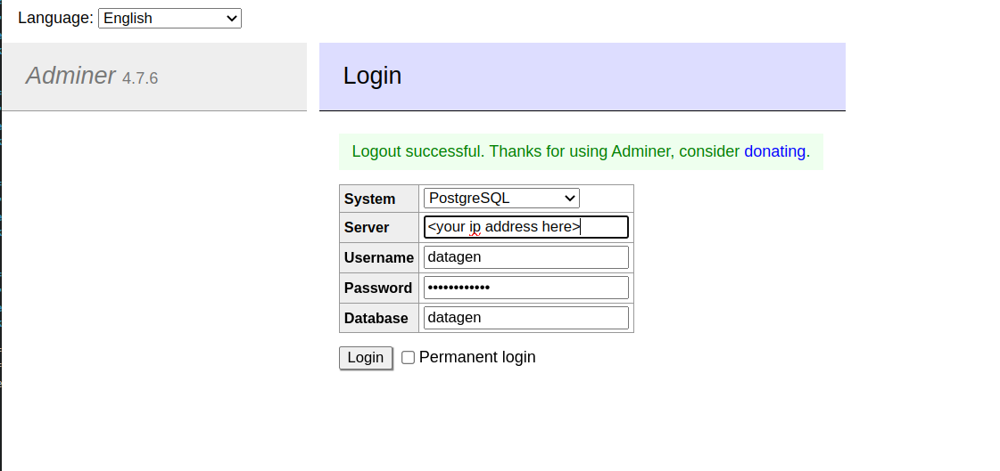

###  SQL GUI client to access the PostgreSQL databases

* It uses a tool called `Adminer` that was installed during setup

---

####  Access the `datagen` database with these credentials:
---
  *  user     --> `datagen` 
  *  Password --> `supersecret1`
   
*  From a browser navigate to: `http://<your ip address>/adminer` 

##### `Datagen` database login screen:
---

---
---

Click here to return to main page:  [`Tabular Workshop`](./README.md).
